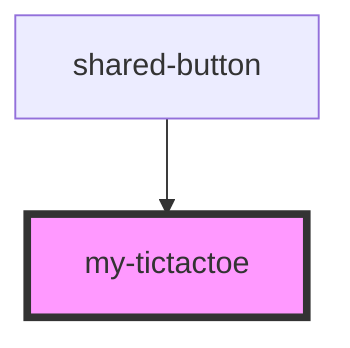

# my-tictactoe

<!-- Auto Generated Below -->

## Properties

| Property | Attribute | Description | Type     | Default   |
| -------- | --------- | ----------- | -------- | --------- |
| `reset`  | `reset`   |             | `string` | `'reset'` |

## Dependencies

### Used by

 - [shared-button](../shared-button)

### Graph

----------------------------------------------

*Built with [StencilJS](https://stenciljs.com/)*
